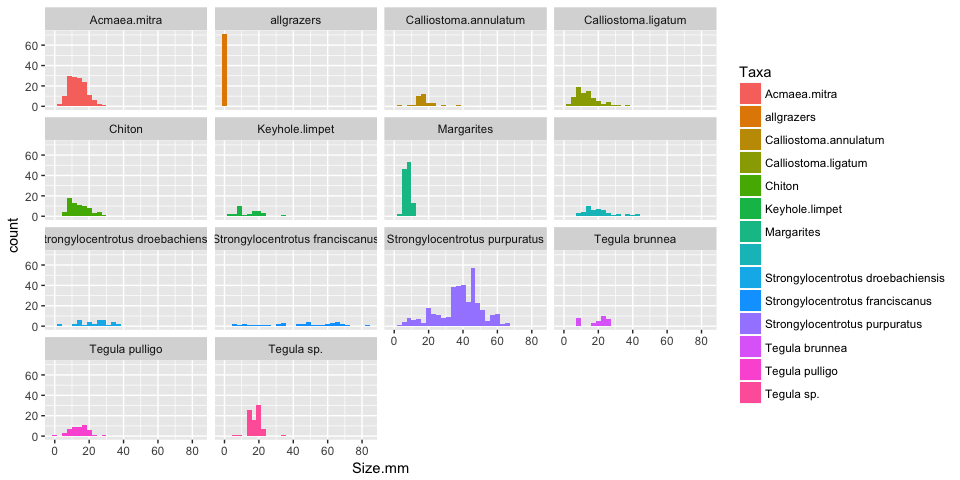

kraccen
================
01 May, 2017

-   [General Goals](#general-goals)
-   [Let's read some data and make a plot](#lets-read-some-data-and-make-a-plot)

<!-- README.md is generated from README.Rmd. Please edit that file -->
General Goals
-------------

Let's read some data and make a plot
------------------------------------

This is Eric just messing aroung to give you some ideas of what you can do here kristy!

Load libraries.

``` r
library(tidyverse)
#> Loading tidyverse: ggplot2
#> Loading tidyverse: tibble
#> Loading tidyverse: tidyr
#> Loading tidyverse: readr
#> Loading tidyverse: purrr
#> Loading tidyverse: dplyr
#> Conflicts with tidy packages ----------------------------------------------
#> filter(): dplyr, stats
#> lag():    dplyr, stats
```

Read the data:

``` r
dat <- read_csv("data/summer16_mesograzers.csv")
#> Parsed with column specification:
#> cols(
#>   Site = col_character(),
#>   Date = col_character(),
#>   Observer = col_character(),
#>   Transect = col_integer(),
#>   Heading = col_integer(),
#>   Quad = col_integer(),
#>   Taxa = col_character(),
#>   Size.mm = col_double()
#> )
```

That reads in nicely.

Let's make some summaries:

``` r
dat %>%
  count(Site, Taxa)
#> Source: local data frame [65 x 3]
#> Groups: Site [?]
#> 
#>      Site                Taxa     n
#>     <chr>               <chr> <int>
#> 1  Breast        Acmaea.mitra    22
#> 2  Breast          allgrazers     1
#> 3  Breast       Boring.limpet     9
#> 4  Breast Calliostoma.ligatum    30
#> 5  Breast              Chiton    41
#> 6  Breast          Fissurella     3
#> 7  Breast      Keyhole.limpet     3
#> 8  Breast    Limpet.long.flat     7
#> 9  Breast  Limpet.round.brown     4
#> 10 Breast    Limpet.varigated     1
#> # ... with 55 more rows
```

How many taxa?

``` r
dat %>%
  count(Taxa) %>%
  arrange(desc(n))
#> # A tibble: 27 × 2
#>                               Taxa     n
#>                              <chr> <int>
#> 1    Strongylocentrotus purpuratus   357
#> 2                     Acmaea.mitra   143
#> 3                       Margarites   114
#> 4                       Tegula sp.    83
#> 5              Calliostoma.ligatum    80
#> 6                           Chiton    72
#> 7                       allgrazers    71
#> 8                   Tegula pulligo    48
#> 9           Pomaulax.gibberosa\xca    47
#> 10 Strongylocentrotus franciscanus    39
#> # ... with 17 more rows
```

Now, let's plot histograms of size.mm for Taxa with &gt;= 30 observations:

``` r
# count observations
taxa <- dat %>%
  count(Taxa) %>%
  filter(n>=30)

# filter data set to those with >= 30
dat %>%
  filter(Taxa %in% taxa$Taxa) %>%
  ggplot(mapping = aes(x = Size.mm, fill = Taxa)) +
  geom_histogram() +
  facet_wrap(~ Taxa, ncol = 4)  
#> `stat_bin()` using `bins = 30`. Pick better value with `binwidth`.
```



OK, this has been fun!
